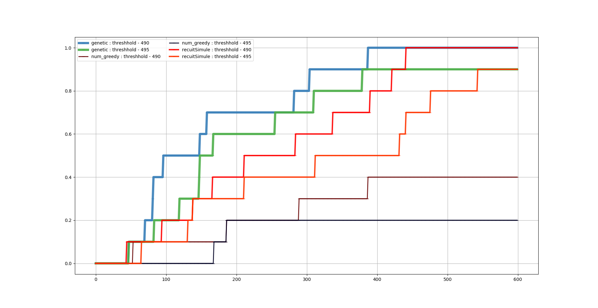
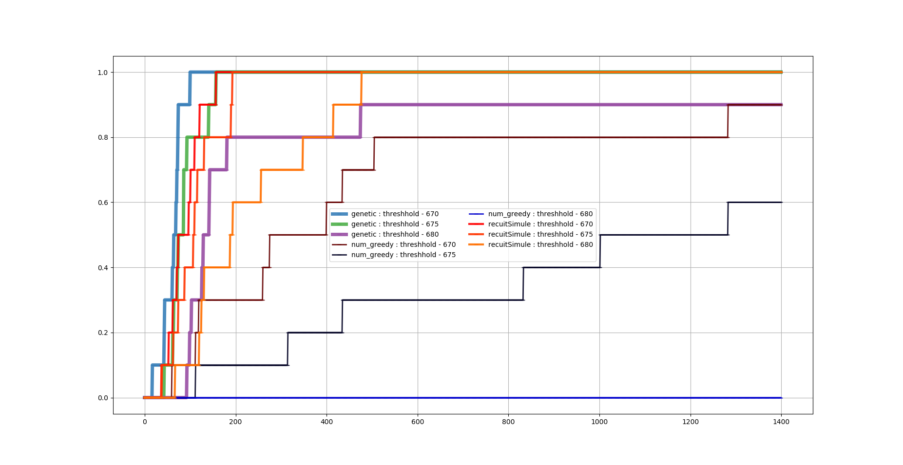

# Kaminskyi Nazar-Mykola:
# IA308 — Stochastic Heuristics Optimization


# Génétique

Pour exécuter un algorithme Génétique, il faut exécuter la commande:

```
python snp.py -n NUMBER_OF_SENSORS -m genetic -gs SIZE_OF_GENERATION --n_run #_run -i 1500 -y 1500
```

---
# ERT

Pour tracer **ERT**, utilisez la commande suivante:
```
python ert.py -t THRESHHOLDS -i NUMBER_OF_ITERATION_IN_ALL_FILES -n #_runs -ns NUMBER_OF_SENSORS -e 1
```

- Le paramètre **e** est utilisé pour exécuter les algorithmes (1 - exécuter des algorithmes et afficher ERT, 0 - afficher ERT avec les données fournies).

Les fichiers doivent avoir un nom : **Nom de l'algorithme + numéro de lancement .csv**

Par exemple:
```
genetic0.csv, genetic1.csv, genetic2.csv, ..., geneticN.csv
recuitSimule0.csv, recuitSimule1.csv, recuitSimule2.csv, ..., recuitSimuleN.csv
num_greedy0.csv, num_greedy1.csv, num_greedy2.csv, ..., num_greedyN.csv
```

**Remarque:** Les fichiers de données doivent être supprimés à chaque fois avant le démarrage, sinon les nouvelles données seront écrites à la fin des fichiers existants.

---
# Objective function

Pour remplacer la fonction objective, spécifiez le nom de la fonction dans le fichier **snp.py** aux endroits suivants:
- line 85
- line 86

```
  num_objective_function = num.cover_sum
  bit_objective_function = bit.cover_sum
```

---
# Quelques résultats

#### 2 sensors

```
python ert.py -t 490 -i 600 -ns 2 -e 1 -n 10

```


#### 3 sensors
```
python ert.py -t 680 -i 1400 -ns 3 -e 1 -n 10

```


